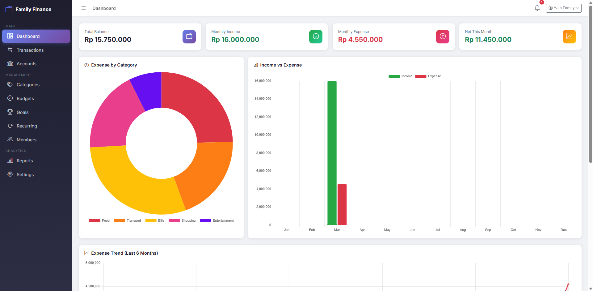
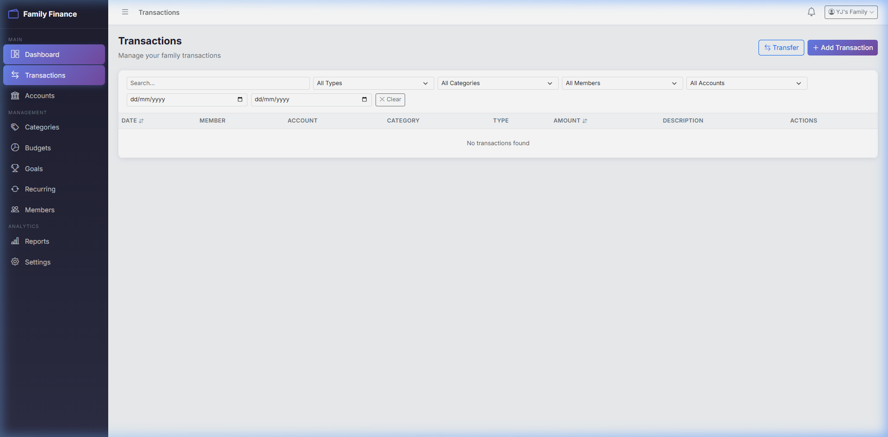
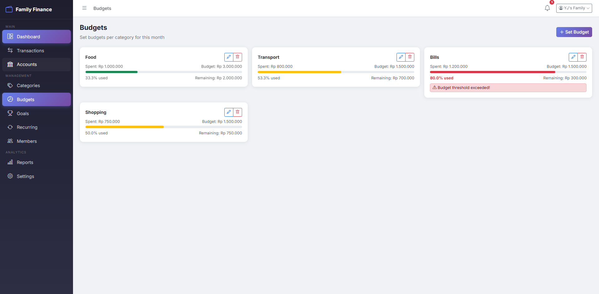
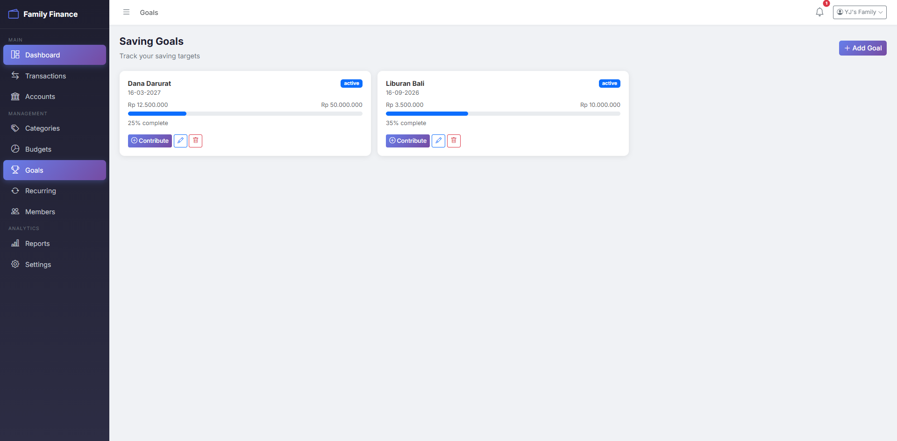
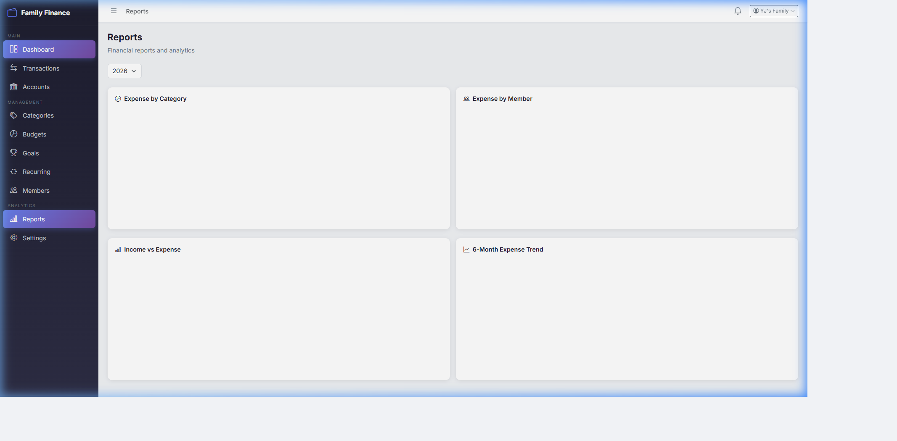
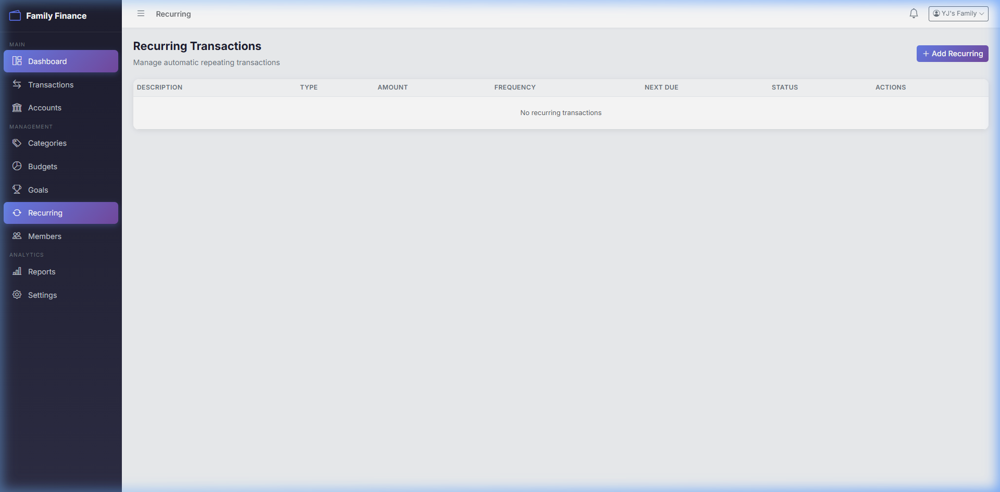
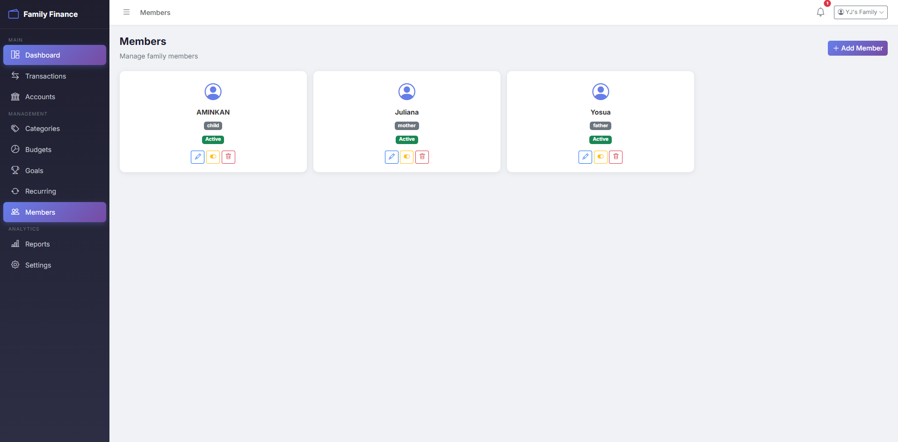
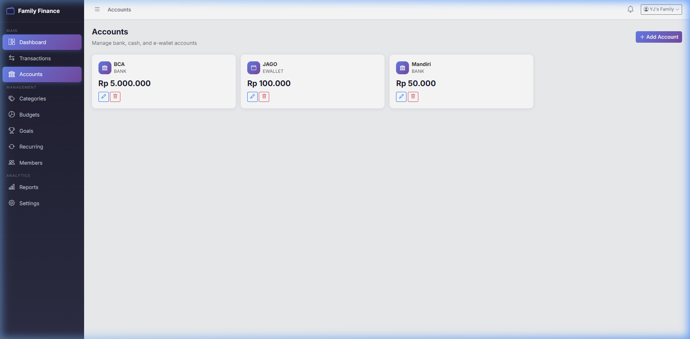
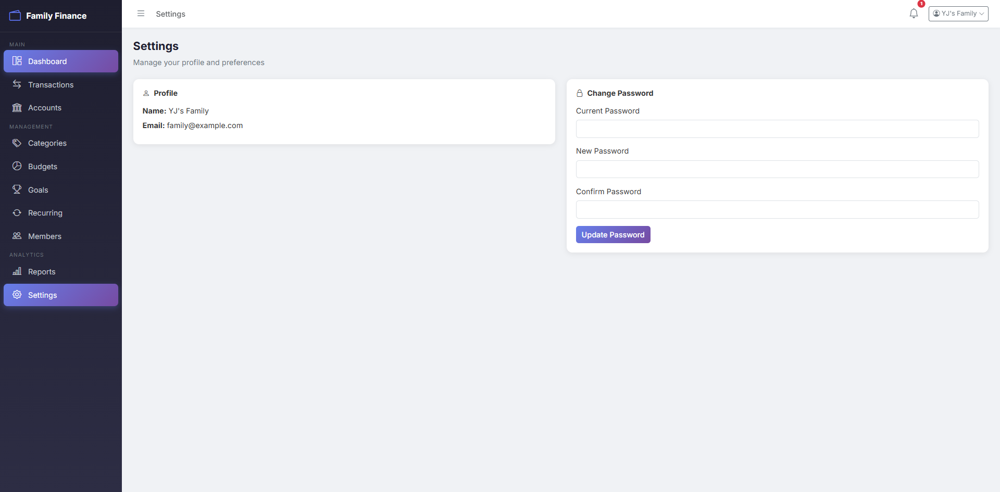

# Sistem Manajemen Keuangan Keluarga

Aplikasi pencatatan keuangan keluarga yang siap digunakan pada lingkungan produksi (production-ready). Sistem ini dirancang untuk digunakan oleh satu keluarga (menggunakan satu akun utama sebagai pusat) dengan beberapa anggota individu yang dapat mencatat pemasukan, pengeluaran, anggaran, target tabungan, dan transaksi berulang dalam satu dashboard terpadu.

Sistem ini menyediakan pencatatan akuntansi **dual-entry** untuk transfer antar akun serta **notifikasi real-time pada frontend** ketika penggunaan anggaran mendekati batas tertentu.

## Struktur Proyek

Repositori ini menggunakan struktur **monorepo** yang berisi aplikasi frontend dan backend:

*   [`/backend`](./backend) - REST API berbasis Laravel 11. Menangani seluruh penyimpanan data, logika bisnis, autentikasi, dan penjadwalan proses background.
*   [`/frontend`](./frontend) - Vue 3 Single Page Application (SPA). Antarmuka pengguna yang responsif dan dinamis yang dibangun menggunakan Vite, Vue Router, Pinia, dan Bootstrap.

## Arsitektur

*   **API Framework**: Laravel 11 
*   **Database**: MySQL 8
*   **Authentication**: Laravel Sanctum (berbasis token)
*   **Frontend Framework**: Vue 3 (Composition API)
*   **Build Tool**: Vite
*   **State Management**: Pinia
*   **Styling**: Custom CSS berbasis Bootstrap 5
*   **Charts**: Chart.js / Vue-Chartjs

## Fitur Utama

1.  **Manajemen Anggota**: Menambahkan anggota keluarga (Ayah, Ibu, Anak, dll.) dan mengaitkan transaksi kepada masing-masing anggota.
2.  **Manajemen Akun**: Melacak saldo pada kas, rekening bank, dan e-wallet.
3.  **Pencatatan Transaksi**: Mencatat pemasukan, pengeluaran, serta transfer antar akun keluarga menggunakan sistem dual-entry.
4.  **Anggaran (Budget)**: Menentukan batas pengeluaran bulanan per kategori dengan progress bar real-time serta notifikasi ketika penggunaan mencapai 80%.
5.  **Target Tabungan (Saving Goals)**: Melacak jumlah target dan tenggat waktu untuk pembelian atau tujuan dana tertentu.
6.  **Transaksi Berulang (Recurring Transactions)**: Secara otomatis mencatat tagihan atau gaji yang berulang berdasarkan frekuensi mingguan, bulanan, atau tahunan.
7.  **Dashboard Analitik**: Menyediakan laporan visual berupa grafik batang pemasukan/pengeluaran, tren 6 bulan, dan diagram pie distribusi kategori.

## Roadmap Deployment

Aplikasi ini siap untuk dijalankan menggunakan Docker atau dideploy pada stack server LEMP/LAMP standar. Silakan merujuk pada file README khusus di direktori `/backend` dan `/frontend` untuk panduan lengkap setup lokal.

## Tangkapan Layar (Screenshots)

Berikut adalah beberapa tampilan halaman dari aplikasi:

### 1. Dashboard Utama

### 2. Transaksi (Transactions)

### 3. Anggaran (Budgets)

### 4. Target Tabungan (Goals)

### 5. Laporan Analitik (Reports)

### 6. Transaksi Berulang (Recurring)

### 7. Kelola Anggota Kawanan (Members)

### 8. Rekening & Dompet (Accounts)

### 9. Kategori Pemasukan & Pengeluaran (Categories)

### 10. Pengaturan Profil (Settings)
